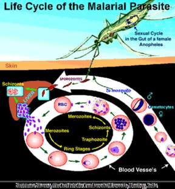

#                                                        AI4GOOD

## USING STATE-OF-THE-ART DEEP LEARNING (CNN) TO DETERMINE PARASITEMIA LEVEL IN BLOOD SMEAR IMAGES 

## PROJECT INTRO

This project is Team SEMA's solution to one of the medical problems identified by [SuperFluid Labs](https://superfluid.io/ai-commons/) during an ideation Workshop from 31/08/2020-29/09/2020. It is a hackathon which commenced from 6/10/2020 and will last till 29/10/2020....

## PROBLEM THAT THIS PROJECT SEEKS TO SOLVE

Malaria has been identified by the World Health Organization as one of the leading
causes of deaths in the world. It is caused by a plasmodium parasites which can spread
from one person to another through the bite of the female anopheles mosquito.This
problem has been identified by various bodies and organizations such as the World
Health organization, the Ghana Health Service and Centre for Disease Control.The
early symptoms of the disease are similar to that of flu or a virus when the infected
person usually start feeling sick within a few days or weeks after the mosquito bite. It
has very adverse effects and can be fatal if not diagnosed and treated quickly. It is for
this reason that timely diagnosis of malaria is expedient. When malaria is diagnosed
early enough, it can be treated and thereby reduceing the risk of it advancing into
undesirable conditions and death. Existing diagnostic methods such as the Polymerase
Chain Reaction (PCR) test, Rapid Diagnostic Test(RDT) and microscopy test have been
efficient to some extent. But looking at the estimated 400,000 deaths per year due to
malaria, there is room for more effective and efficient methods

.

### HACKATHON ORGANIZERS

* [Super Fluid Labs](https://superfluid.io/)
* [AI Commons](https://ai-commons.org/)

## HACKATHON TEAM MEMBERS 

| NAME                    | EXPERTISE |
| :---                    | --- |
| Patrick Attankurugu     | Data Scientist(Team Lead) | 
| Franklin Osei           | Machine Learning Engineer|
| Douglas Billy           | UX/UI Designer |     
| Mohammed Awal           |Mobile App Developer |          

## OTHER CONTRIBUTORS

| NAME                    | POSITION/EXPERTISE |
|:---                     | --- | 
| Kwadwo Dwomo            | CEO(Comcent Ltd) | 
| Joshua Akangah          | Software Developer | 

### Methods Used

* Machine Learning
* Data Visualization
* etc.

### Technologies

* Python
* PostGres
* Flask
* Pandas, jupyter
* HTML
* CSS
* Bootstrap
* JavaScript
* Colab
* etc. 

## Needs of this project

- Android Developer
- Ios Developer

## Contact

* Feel free to contact team lead here <patricka.azuma@gmail.com>.

.
